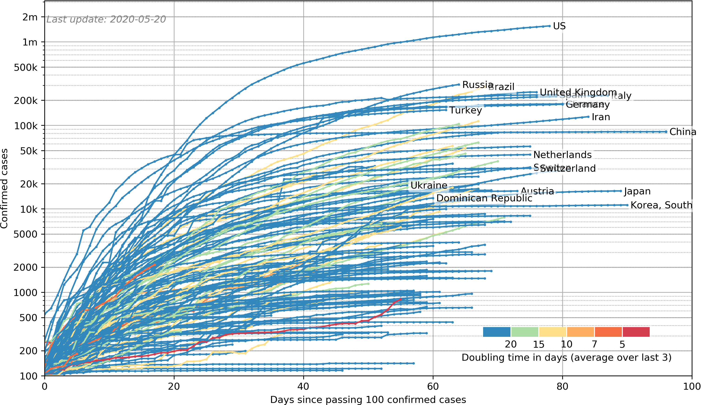
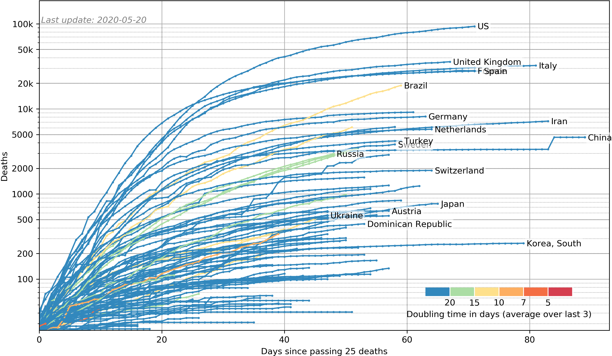
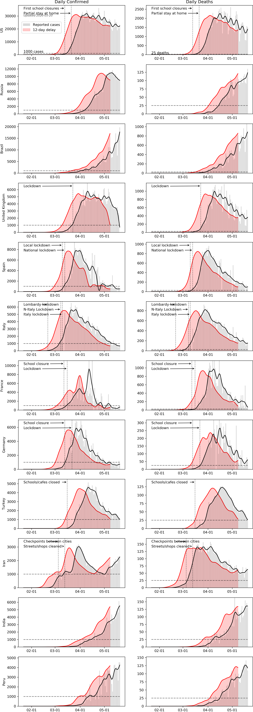
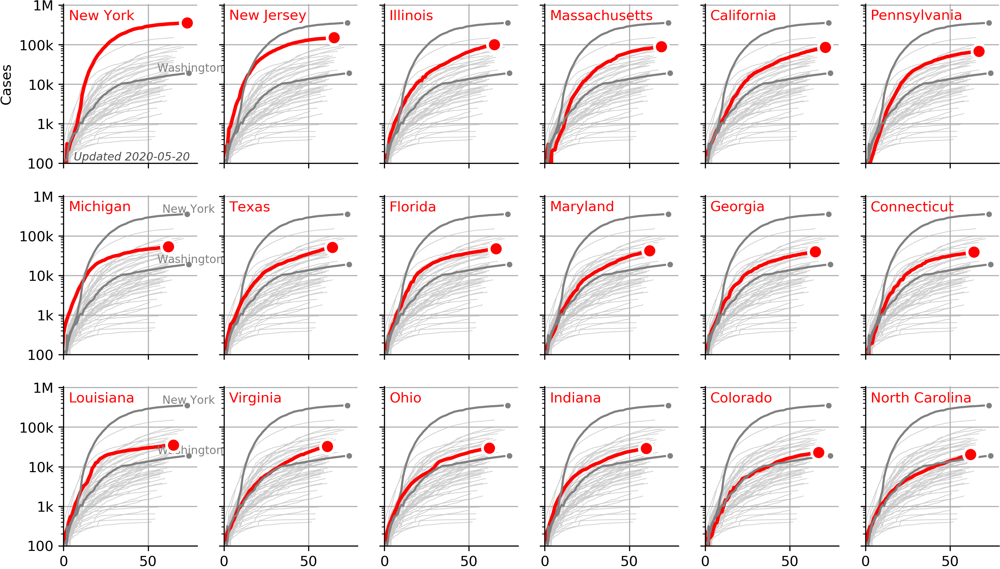
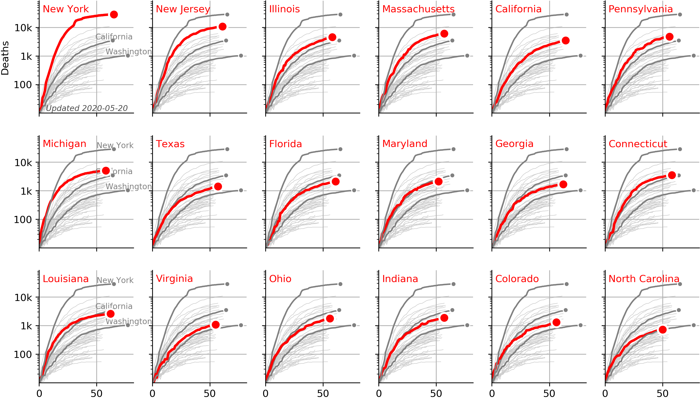
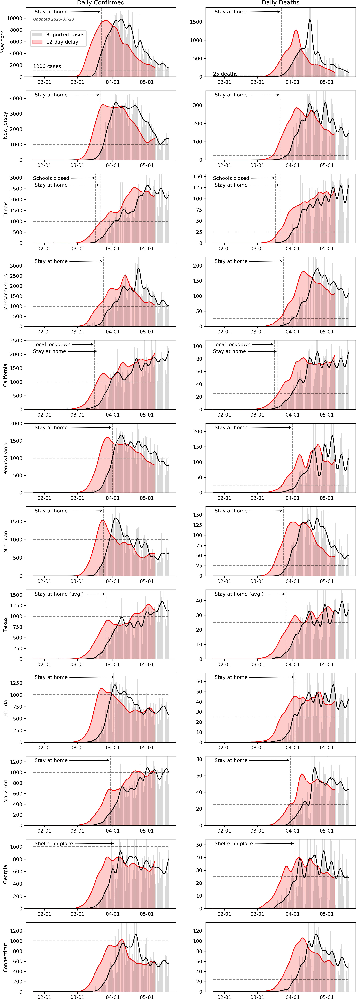

# COVID19 analysis

This repository contains analysis of the data on Covid-19 published daily by Johns Hopkins University. In this analysis I look at daily increase of reported cases and deaths per country and per US state. I annotated some of the graphs with dates of government response.

* [Total per country](#country_log)
* [Daily cases per country](#country_daily)
* [Total cases per state](#state_log)
* [Daily cases per state](#state_daily)

<b>Sources:</b>
* https://github.com/CSSEGISandData/COVID-19 (data on number of cases)
* https://en.wikipedia.org/wiki/2019%E2%80%9320_coronavirus_pandemic_by_country_and_territory (government response per country)
* https://www.thelancet.com/journals/laninf/article/PIIS1473-3099(20)30120-1/fulltext (inspiration for daily graphs)
* https://www.nytimes.com/interactive/2020/us/coronavirus-stay-at-home-order.html (government response per state)

<b>Interesting reads: </b>
* https://medium.com/@tomaspueyo/coronavirus-act-today-or-people-will-die-f4d3d9cd99ca
* https://medium.com/@tomaspueyo/coronavirus-the-hammer-and-the-dance-be9337092b56

## Average daily cases in the last seven days around the world <!-- US and in the world.-->

          |     
:-------------------------:|:-------------------------:

## Cases per country  

## Deaths per country 

## Cases per country, highlighted

## Deaths per country, highlighted

## Daily cases and deaths per country  
I have added a black curve to smooth out day to day variation. Additionally I added a curve with a 12 day delay and a stronger smoothening in red, the idea being that symptoms take a while to develop and it may take a while for testing to take place and to be registered. These graphs were inspired by this paper: https://jamanetwork.com/journals/jama/fullarticle/2762130.

Note that reported cases is generally considered to be an underrepresentation of the actual cases, though by how much depends strongly on factors such as testing capability. Countries such as South Korea and Germany seem to have a better grasp of the number of cases due to their high number of tests per capita.

On these daily cases graphs I added annotations on government response. The naming of the order and the level of restrictions vary per country, and I have used my best judgment to standardize them. Sources for these annotations are [wikipedia](https://en.wikipedia.org/wiki/2019%E2%80%9320_coronavirus_pandemic_by_country_and_territory) and [this article in the new york times](https://www.nytimes.com/interactive/2020/us/coronavirus-stay-at-home-order.html).  

## Curves per state 
Similar analysis to the global data can be performed on local areas. The data for the local areas is generally noisier but since JHU switched to a new format on March 22 it is more reliable.

## Cases highlighted per state

## Deaths highlighted per state

## Daily cases per state 

