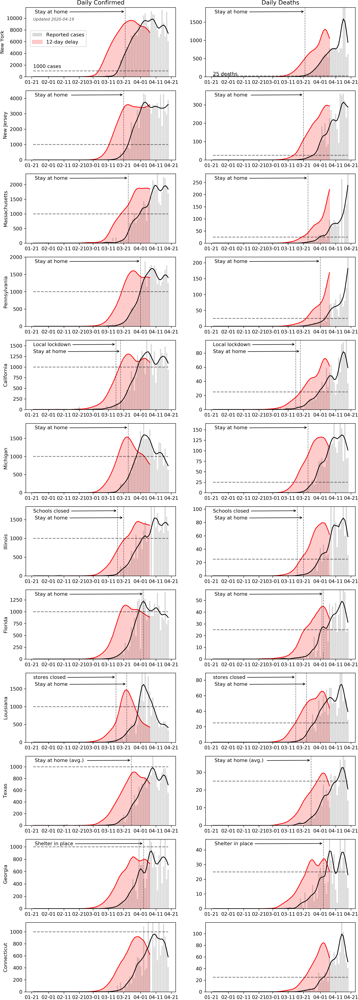

# COVID19 analysis

This repository contains analysis of the data on Covid-19 published daily by Johns Hopkins University. In this analysis I look at daily increase of reported cases and deaths per country, and per US state. I annotated some of the graphs with dates of government response.

* [Total per country](#country_log)
* [Daily cases per country](#country_daily)
* [Total cases per state](#state_log)
* [Daily cases per state](#state_daily)

<b>Work in progress</b>, I'm still trying to fix the following:
* JHU changed their data format for daily reports early March, so my current data merging for states is inaccurate before March 15.
* The annotation wording is sparse and inaccurate, and just a concept for now.
* Highlights per state
* Font, colorscheme, axislabels, legends
* further commenting / readme description

<b>Sources:</b>
* https://en.wikipedia.org/wiki/2019%E2%80%9320_coronavirus_pandemic_by_country_and_territory
* https://github.com/CSSEGISandData/COVID-19
* https://www.thelancet.com/journals/laninf/article/PIIS1473-3099(20)30120-1/fulltext

<b>Interesting reads: </b>
* https://medium.com/@tomaspueyo/coronavirus-act-today-or-people-will-die-f4d3d9cd99ca
* https://medium.com/@tomaspueyo/coronavirus-the-hammer-and-the-dance-be9337092b56

## Average daily cases in the last seven days around the world <!-- US and in the world.-->

          | <!--  -->
:-------------------------:|:-------------------------:

## Cases per country 
     

In the next plot I have higlighted individual countries.

## Daily cases and deaths per country  
I have added a curve to smooth out day to day variation. The annotations are taken from Wikipedia. The naming of the order and the level of restrictions vary per country, and I have used my best judgement to standardize them.

Additionally I added the estimated number of infections. This assumes an 8 day delay between date of infection and the reported case, and an 11 day delay between date of infection and death. I chose these delays based on the curves from China, but they are rather arbitrary and have a large band of uncertainty. The graphs are inspired by this paper: https://jamanetwork.com/journals/jama/fullarticle/2762130.

## Crves per state 
<b>Cases per state</b>

## Daily cases per state 

